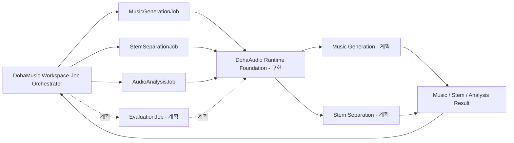

# DohaAudio

> 문서 상태: [계획]
> 구현 상태: Runtime·Pre-Training Readiness·Dataset Admission·Enrollment Gate [구현], 승인 Dataset·실제 모델·Training [미구현]
> 저장소: `DohaStudio/DohaAudio`
> 공통 명세: `0.1.0` / `draft-baseline`
> 명세 기준: `DohaStudio/.github` `main` (`1e4b480c8cbd6e51835f8550e685e9b136d8071d`)

DohaAudio는 DohaMusic을 위한 음악 생성 및 일반 Audio AI Provider 프로젝트입니다. Music Generation뿐 아니라 Instrumental Generation, Stem Separation, Music Analysis, Dataset Pipeline, Training, Fine-tuning, Evaluation, Model Manifest와 독립 Runtime을 담당할 계획입니다.

현재 저장소에는 Provider Runtime, Pre-Training Readiness와 Dataset Admission·Enrollment Gate가 구현되어 있습니다. 교체 가능한 in-memory/SQLite Job repository, 단일 Job worker boundary, Dataset Manifest·권리 Gate, 주입식 read-only authority resolver, normalized rights evidence와 training dry-run을 검증합니다. 실제 Dataset, 모델, Checkpoint와 생성 음원은 포함하지 않습니다.

## 책임

- Music Generation과 Instrumental Generation [계획]
- Stem Separation [계획]
- BPM·Key·Music Structure·Audio Quality Analysis [계획]
- Dataset Manifest·split·integrity·권리 Gate와 authority inventory [구현], 실제 Dataset Pipeline [미구현]
- Training 계약·preflight·dry-run [구현], 실제 Training·Fine-tuning·Evaluation [미구현]
- Checkpoint·공통 Model Registry [계획], Provider-local Model Manifest registry [구현]
- Runtime Foundation과 Provider API [구현]
- Worker execution boundary와 SQLite Job persistence [구현], 실제 모델 Adapter [미구현]

## 비목표

DohaAudio는 Frontend, Next.js, 사용자·회원, Workspace, Project, Lyrics, Recording, Composition Snapshot, Mix, Export, Voice Conversion, Singing Voice, Lyrics Generation을 담당하지 않습니다.

## 저장소 책임 경계

| DohaAudio | DohaMusic |
|---|---|
| 음악 생성·Instrumental | Workspace·Project |
| Stem 분리·오디오 분석 | 가사·Recording |
| Dataset·학습·평가 | Asset와 AssetVersion 관리 |
| Model Manifest, Runtime | Composition Snapshot |
| Provider API | Mix·Export·Provider Orchestration |

Provider끼리는 직접 호출하지 않습니다. DohaAudio 작업은 반드시 DohaMusic 제품 서비스와 Workspace·Job Orchestrator가 생성하고 결과를 회수합니다. DohaAudio가 DohaVocal 또는 DohaLM을 직접 호출하는 흐름은 금지합니다.

`MusicGenerationJob`, `StemSeparationJob`, `AudioAnalysisJob`, `EvaluationJob`은 서로 독립된 Job입니다. 현재 Runtime Foundation은 앞의 세 Job만 구현하며 `EvaluationJob`은 `[계획]`입니다. 한 Job의 성공이 다른 Job을 자동 실행한다는 의미가 아니며, DohaMusic이 저장된 AssetVersion과 Artifact를 입력으로 지정하여 Workspace 상태와 사용자 요청에 따라 각각 생성·연결합니다.



## 외부 저장소 정책

| 구분 | 기준 경로 | Git 포함 여부 |
|---|---|---|
| Dataset | `DohaData/audio` | 금지 |
| Artifact | `DohaArtifacts/audio` | 금지 |
| 임시 파일 | `DohaTemp/audio` | 금지 |
| 코드·schema·문서·설정 예제 | 이 저장소 | 허용 |

절대 경로는 코드와 Manifest에 하드코딩하지 않으며 환경 변수 또는 논리 식별자로 주입합니다.

`DohaArtifacts/audio`는 `checkpoints`, `models`, `generations`, `stems`, `evaluations`, `runs` 영역에 Provider의 모델·실행 결과를 보관합니다. Mix, Export, Preview, Composition Snapshot 같은 Workspace 최종 결과는 DohaMusic 책임이며 `DohaArtifacts/music`에 보관합니다. 두 영역을 서로 대체하거나 중복 저장하지 않습니다.

## 문서

- [DohaStudio 공통 명세 기준선](https://github.com/DohaStudio/.github/tree/main/docs/specifications)
- [DohaStudio 공통 Provider 계약](https://github.com/DohaStudio/.github/blob/main/docs/specifications/04-provider-contract.md)
- [DohaStudio 공통 용어](https://github.com/DohaStudio/.github/blob/main/docs/specifications/10-common-terms.md)
- [문서 인덱스](docs/index.md)
- [Roadmap](ROADMAP.md)
- [프로젝트 범위](docs/00-overview/project-scope.md)
- [요구사항](docs/02-requirements/requirements.md)
- [Provider Architecture](docs/03-architecture/provider-architecture.md)
- [Model Manifest](docs/04-models/model-manifest.md)
- [Dataset 정책](docs/05-data/dataset-policy.md)
- [실제 Dataset Admission 상태](docs/05-data/real-dataset-admission.md)
- [Training 전략](docs/06-training/training-strategy.md)
- [Evaluation 전략](docs/07-evaluation/evaluation-strategy.md)
- [Runtime 계약](docs/08-runtime/runtime-contract.md)
- [보안 정책](docs/09-security/security-policy.md)
- [ADR 인덱스](docs/10-decisions/README.md)

## 개발 상태

Runtime Foundation과 Provider API는 deterministic Fake Provider 기준으로 구현했습니다. `MusicGenerationJob`, `StemSeparationJob`, `AudioAnalysisJob`의 독립 lifecycle, restart 이후 idempotency, atomic worker claim, 취소, 재시도와 stale-running 복구를 실제 모델 없이 검증합니다.

Pre-Training Readiness는 공통 Dataset Manifest 의미 계약에 맞춘 불변 DatasetVersion, deterministic split, checksum·provenance 무결성, fail-closed rights evidence와 training eligibility, TrainingRun/config snapshot, model compatibility preflight와 read-only dry-run을 제공합니다. `PRE_TRAINING_READY`는 이 계약 fixture가 Training 시작 직전 Gate를 통과한다는 의미이며 법률 승인, 실제 Dataset 승인, GPU 검증 또는 Training 실행을 뜻하지 않습니다.

Dataset Admission Foundation은 `DOHAAUDIO_DATASET_ROOT`로 local authority 후보를 주입하고 root escape·symlink/junction·지원 형식·checksum·중복을 read-only로 검사한 뒤 공개 계약에는 logical ID만 반환합니다. Enrollment Gate는 공급자 원문과 분리된 evidence adapter를 통해 candidate·Manifest·evidence ID·scope를 결합하고 exact inventory membership을 기존 Dataset Manifest에 등록합니다. 현재 조사된 세 후보는 권리, 형식, membership 또는 승인 근거가 부족해 모두 `BLOCKED`이며 실제 Dataset Manifest·DatasetVersion·Split·TrainingConfig는 발급하지 않았습니다.

```powershell
python -m pip install -e ".[dev,runtime]"
python -m uvicorn dohaaudio.api:app --app-dir src
python -m pytest
```

API는 DohaMusic 목표 계약의 `/api/v1/providers/audio` namespace를 사용합니다. `CreateJob`은 `queued` Job만 생성하며 embedding host가 `ExecutionWorker.run_once()`를 호출합니다. Background daemon과 새 Training HTTP API는 추가하지 않았습니다. 실제 Dataset·모델·Checkpoint·optimizer·GPU·성능·VRAM·법률 승인과 DohaMusic network 통합은 여전히 `[미구현]` 또는 `[검증 필요]`입니다.

SQLite persistence는 `bootstrap_persistent_runtime(database_path)`로 논리 위치를 주입하며 한 개 `jobs` aggregate table을 schema bootstrap합니다. DB 경로는 API에 노출하지 않고 테스트는 Git 제외 temporary DB만 사용합니다.

## 기여와 라이선스

- 기여 절차: [CONTRIBUTING.md](CONTRIBUTING.md)
- 변경 이력: [CHANGELOG.md](CHANGELOG.md)
- 코드와 문서 라이선스: [Apache License 2.0](LICENSE)
- Dataset, 외부 모델, 모델 가중치, Checkpoint, Adapter, 생성 음원, Stem 결과, 평가 샘플과 제3자 콘텐츠에는 저장소의 Apache-2.0이 적용되지 않으며 각 항목의 별도 권리와 라이선스를 따릅니다.
