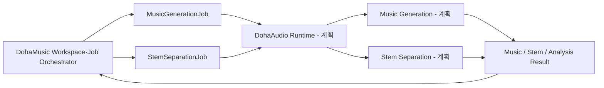

# DohaAudio

> 문서 상태: [계획]
> 구현 상태: Music Generator, Training, Runtime, Provider API 모두 [미구현]
> 저장소: `DohaStudio/DohaAudio`

DohaAudio는 DohaMusic을 위한 음악 생성 및 일반 Audio AI Provider 프로젝트입니다. Music Generation뿐 아니라 Instrumental Generation, Stem Separation, Music Analysis, Dataset Pipeline, Training, Fine-tuning, Evaluation, Model Manifest와 독립 Runtime을 담당할 계획입니다.

현재 저장소는 문서 기반 Architecture bootstrap 단계입니다. Dataset, 모델, Checkpoint, Runtime 코드와 생성 음원은 포함하지 않습니다.

## 책임

- Music Generation과 Instrumental Generation [계획]
- Stem Separation [계획]
- BPM·Key·Music Structure·Audio Quality Analysis [계획]
- Music Dataset Pipeline [계획]
- Training·Fine-tuning·Evaluation [계획]
- Checkpoint·Model Registry·Model Manifest 관리 [계획]
- Runtime과 Provider API [계획]

## 비목표

DohaAudio는 Frontend, Next.js, 사용자·회원, Workspace, Project, Lyrics, Recording, Composition Snapshot, Mix, Export, Voice Conversion, Singing Voice, Lyrics Generation을 담당하지 않습니다.

## 저장소 책임 경계

| DohaAudio | DohaMusic |
|---|---|
| Music Generation, Instrumental | Workspace, Project |
| Stem Separation, Audio Analysis | Lyrics, Recording |
| Dataset, Training, Evaluation | Asset와 AssetVersion 관리 |
| Model Manifest, Runtime | Composition Snapshot |
| Provider API | Mix, Export, Provider Orchestration |

Provider끼리는 직접 호출하지 않습니다. DohaAudio 작업은 반드시 DohaMusic 제품 서비스와 Workspace·Job Orchestrator가 생성하고 결과를 회수합니다. DohaAudio가 DohaVocal 또는 DohaLM을 직접 호출하는 흐름은 금지합니다.

`MusicGenerationJob`과 `StemSeparationJob`은 서로 독립된 Job입니다. 음악 생성 성공이 Stem 분리를 자동 실행한다는 의미가 아니며, DohaMusic이 Workspace 상태와 사용자 요청에 따라 각각 생성·연결합니다.

## 외부 저장소 정책

| 구분 | 기준 경로 | Git 포함 여부 |
|---|---|---|
| Dataset | `DohaData/audio` | 금지 |
| Artifact | `DohaArtifacts/audio` | 금지 |
| 임시 파일 | `DohaTemp/audio` | 금지 |
| 코드·schema·문서·설정 예제 | 이 저장소 | 허용 |

절대 경로는 코드와 Manifest에 하드코딩하지 않으며 환경 변수 또는 논리 식별자로 주입합니다.

## 문서

- [문서 인덱스](docs/index.md)
- [Roadmap](ROADMAP.md)
- [프로젝트 범위](docs/00-overview/project-scope.md)
- [요구사항](docs/02-requirements/requirements.md)
- [Provider Architecture](docs/03-architecture/provider-architecture.md)
- [Model Manifest](docs/04-models/model-manifest.md)
- [Dataset 정책](docs/05-data/dataset-policy.md)
- [Training 전략](docs/06-training/training-strategy.md)
- [Evaluation 전략](docs/07-evaluation/evaluation-strategy.md)
- [Runtime 계약](docs/08-runtime/runtime-contract.md)
- [보안 정책](docs/09-security/security-policy.md)
- [ADR 인덱스](docs/10-decisions/README.md)

## 개발 상태

모든 Roadmap Phase는 현재 `[계획]`입니다. 구현·실험·성능·VRAM·라이선스는 실제 근거가 확보되기 전까지 완료 또는 검증됨으로 표현하지 않습니다.

## 기여와 라이선스

- 기여 절차: [CONTRIBUTING.md](CONTRIBUTING.md)
- 변경 이력: [CHANGELOG.md](CHANGELOG.md)
- 라이선스: [검토 필요](LICENSE). 공개 열람은 사용·복제·재배포 허가를 의미하지 않습니다.
