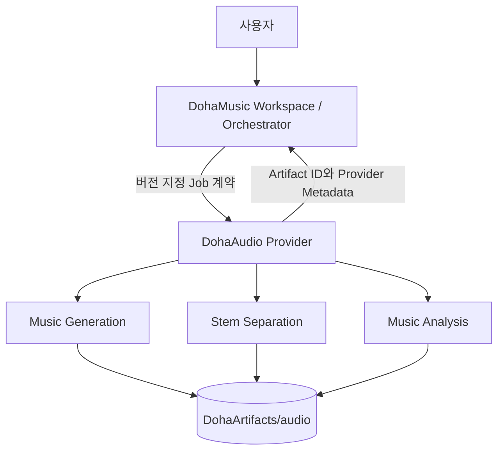

# Provider 아키텍처

> 문서 상태: [계획]
> Runtime·Pre-Training Readiness Foundation·Provider API 상태: [구현]
> 공통 명세: `0.1.0` / `draft-baseline`

## 호출 경계



DohaAudio는 DohaVocal과 DohaLM을 직접 호출하지 않습니다. 여러 Provider의 결과 결합, 순서, 취소, GPU admission과 최종 Workspace 상태는 DohaMusic 제품 서비스와 Workspace·Job Orchestrator가 관리합니다.

`MusicGenerationJob`, `StemSeparationJob`, `AudioAnalysisJob`, `EvaluationJob`은 독립된 Job 계약입니다. 현재 Runtime Foundation 구현 범위는 앞의 세 Job이며 `EvaluationJob`은 `[계획]`입니다. 각 Job은 저장된 입력·출력 AssetVersion과 Artifact를 통해 연결할 수 있지만 DohaAudio 내부에서 한 Job이 다른 Job을 암묵적으로 실행하지 않습니다. 고정된 일괄 Pipeline 순서를 Provider가 결정하지 않습니다.

## 구현 계층

```text
FastAPI Provider API
→ JobApplicationService
→ JobRepository (in-memory 또는 SQLite) / ExecutionWorker
→ AudioProvider capability interface
→ FakeAudioProvider 또는 향후 Real Provider Adapter
→ Artifact Catalog / ArtifactResolver / Model Manifest registry

DatasetManifestRegistry
→ integrity·rights·eligibility validation
→ TrainingReadinessService
→ immutable TrainingRun preview / read-only dry-run
```

SQLite Job repository는 Job aggregate 단위 method가 transaction owner입니다. create와 idempotency index, retry lineage, lifecycle payload를 한 transaction에서 갱신하여 부분 Job·부분 idempotency row를 만들지 않습니다. Worker는 짧은 atomic claim transaction 뒤 Provider를 호출하며 DB transaction을 실행 동안 유지하지 않습니다.

동시 worker는 하나의 `claim_token`만 획득합니다. `running` lease가 만료되면 같은 Job을 자동 재실행하지 않고 `WORKER_LEASE_EXPIRED` structured error의 retryable `failed`로 복구합니다. 명시적 Retry만 새 Job을 만듭니다.

## 출력 유형

- Music Asset 후보
- Stem Asset 후보
- Analysis Result
- Model Metadata
- Provider Metadata

DohaMusic이 Workspace Asset와 AssetVersion의 최종 소유자입니다. DohaAudio의 파일은 `DohaArtifacts/audio`에 있고 DohaMusic에는 Artifact ID, checksum, format, provenance와 상태를 반환합니다.

## Job 상태

공통 상태는 `queued`, `running`, `succeeded`, `failed`, `cancelled`입니다. 종료 상태는 되돌리지 않으며 Retry는 `retry_of_job_id`와 새 `job_id`를 가진 새 Job입니다. Fake Provider의 queued·running 취소는 Worker Foundation에서 즉시 최종 `cancelled`로 반영하며 worker는 실행 전후 cancellation을 관찰합니다. 재현 감사 기준은 공통 명세 commit `1e4b480c8cbd6e51835f8550e685e9b136d8071d`입니다.

Provider Registry와 Capability Registry는 Provider 선택과 지원 capability 검증만 담당합니다. 여러 Provider 순서, GPU admission과 Workspace Selection은 구현하지 않으며 DohaMusic 책임으로 유지합니다.

## 관련 결정

- [ADR-001 Repository Boundary](../10-decisions/ADR-001-repository-boundary.md)
- [ADR-002 Provider Contract](../10-decisions/ADR-002-provider-contract.md)
- [ADR-004 Artifact Lifecycle](../10-decisions/ADR-004-artifact-lifecycle.md)

## Human semantic review governance

Bounded evidence 이후의 human review는 `ReviewerAuthorityRegistry`와 `HumanSemanticReviewWorkflow` domain service가 담당합니다. Request·decision·revocation은 불변 record이고 최종 role-policy 소비 시 현재 evidence·policy·authority를 다시 확인합니다. 이 service는 authentication 또는 HTTP endpoint를 제공하지 않으므로 실제 reviewer identity mapping과 production approval은 비활성화되어 있습니다.
