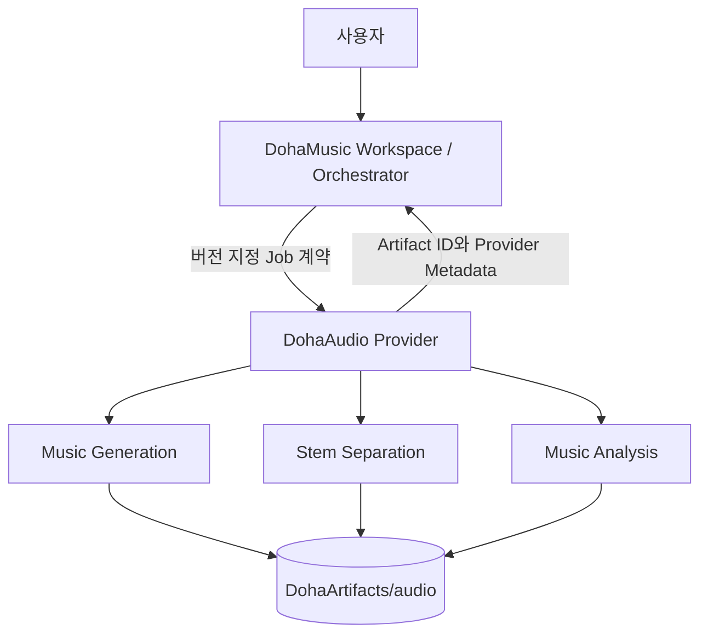

# Provider 아키텍처

> 문서 상태: [계획]
> Runtime·Provider API 상태: [미구현]
> 공통 명세: `0.1.0` / `draft-baseline`

## 호출 경계



DohaAudio는 DohaVocal과 DohaLM을 직접 호출하지 않습니다. 여러 Provider의 결과 결합, 순서, 취소, GPU admission과 최종 Workspace 상태는 DohaMusic 제품 서비스와 Workspace·Job Orchestrator가 관리합니다.

`MusicGenerationJob`, `StemSeparationJob`, `AudioAnalysisJob`, `EvaluationJob`은 독립된 Job 계약입니다. 각 Job은 저장된 입력·출력 AssetVersion과 Artifact를 통해 연결할 수 있지만 DohaAudio 내부에서 한 Job이 다른 Job을 암묵적으로 실행하지 않습니다. 고정된 일괄 Pipeline 순서를 Provider가 결정하지 않습니다.

## 계층 목표

```text
Provider API
→ Application Job Service
→ Capability Interface
→ Model Adapter
→ Runtime / Artifact Storage
```

## 출력 유형

- Music Asset 후보
- Stem Asset 후보
- Analysis Result
- Model Metadata
- Provider Metadata

DohaMusic이 Workspace Asset와 AssetVersion의 최종 소유자입니다. DohaAudio의 파일은 `DohaArtifacts/audio`에 있고 DohaMusic에는 Artifact ID, checksum, format, provenance와 상태를 반환합니다.

## Job 상태 초안

공통 상태는 `pending`, `running`, `succeeded`, `failed`, `canceled`를 사용합니다. 취소 요청과 재시도 예약은 상태를 늘리지 않고 별도 시각·사유·시도 Metadata로 표현합니다. 상세 enum과 오류 schema는 [DohaStudio 공통 Provider 계약](https://github.com/DohaStudio/.github/blob/main/docs/specifications/04-provider-contract.md)을 기준으로 Runtime API 구현 전에 확정해야 합니다. 재현 감사가 필요한 경우에는 기준 커밋 `1e4b480c8cbd6e51835f8550e685e9b136d8071d`를 사용합니다.

## 관련 결정

- [ADR-001 Repository Boundary](../10-decisions/ADR-001-repository-boundary.md)
- [ADR-002 Provider Contract](../10-decisions/ADR-002-provider-contract.md)
- [ADR-004 Artifact Lifecycle](../10-decisions/ADR-004-artifact-lifecycle.md)
