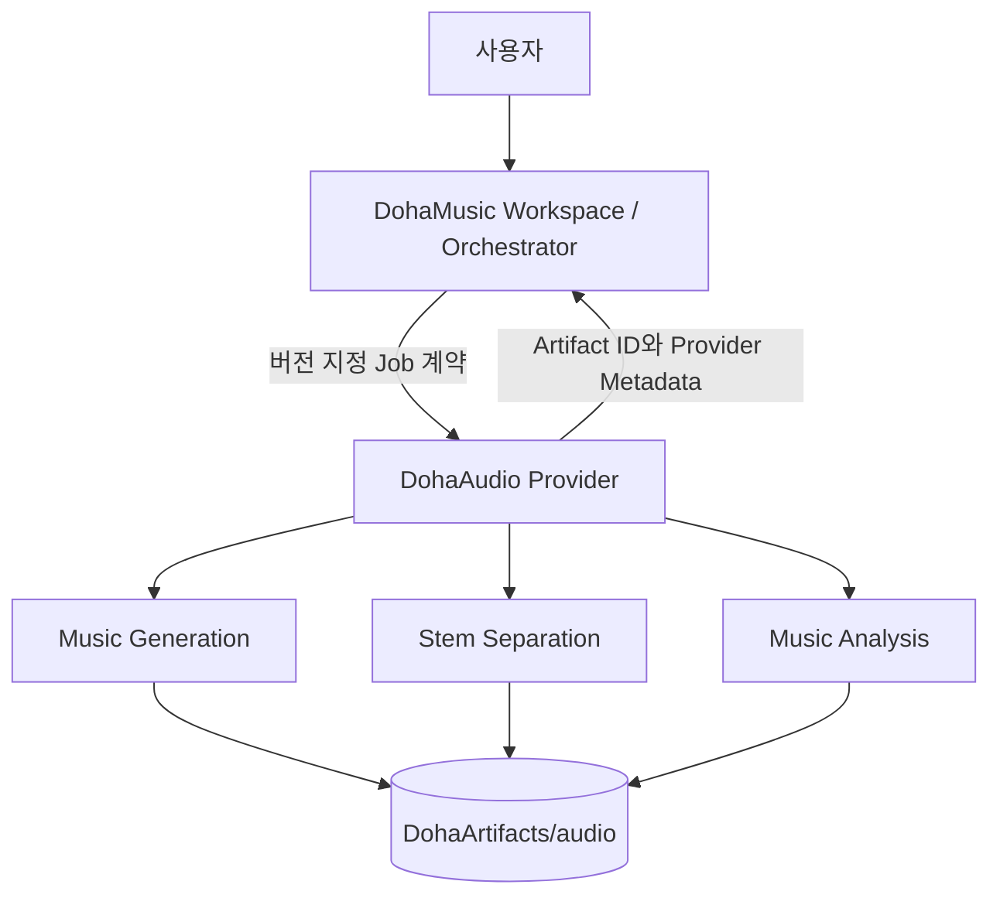

# Provider Architecture

> 문서 상태: [계획]
> Runtime·Provider API 상태: [미구현]

## 호출 경계



DohaAudio는 DohaVocal과 DohaLM을 직접 호출하지 않습니다. 여러 Provider의 결과 결합, 순서, 취소, GPU admission과 최종 Workspace 상태는 DohaMusic Pipeline Orchestrator가 관리합니다.

## 계층 목표

```text
Provider API
→ Application Job Service
→ Capability Interface
→ Model Adapter
→ Runtime / Artifact Storage
```

## 출력 유형

- Music Asset 후보
- Stem Asset 후보
- Analysis Result
- Model Metadata
- Provider Metadata

DohaMusic이 Workspace Asset와 AssetVersion의 최종 소유자입니다. DohaAudio의 파일은 `DohaArtifacts/audio`에 있고 DohaMusic에는 Artifact ID, checksum, format, provenance와 상태를 반환합니다.

## Job 상태 초안

`QUEUED`, `RUNNING`, `SUCCEEDED`, `FAILED`, `CANCEL_REQUESTED`, `CANCELLED`, `RETRY_SCHEDULED`를 후보로 둡니다. 최종 enum과 오류 schema는 Provider API 구현 전 DohaMusic 계약과 함께 확정해야 합니다.

## 관련 결정

- [ADR-001 Repository Boundary](../10-decisions/ADR-001-repository-boundary.md)
- [ADR-002 Provider Contract](../10-decisions/ADR-002-provider-contract.md)
- [ADR-004 Artifact Lifecycle](../10-decisions/ADR-004-artifact-lifecycle.md)
